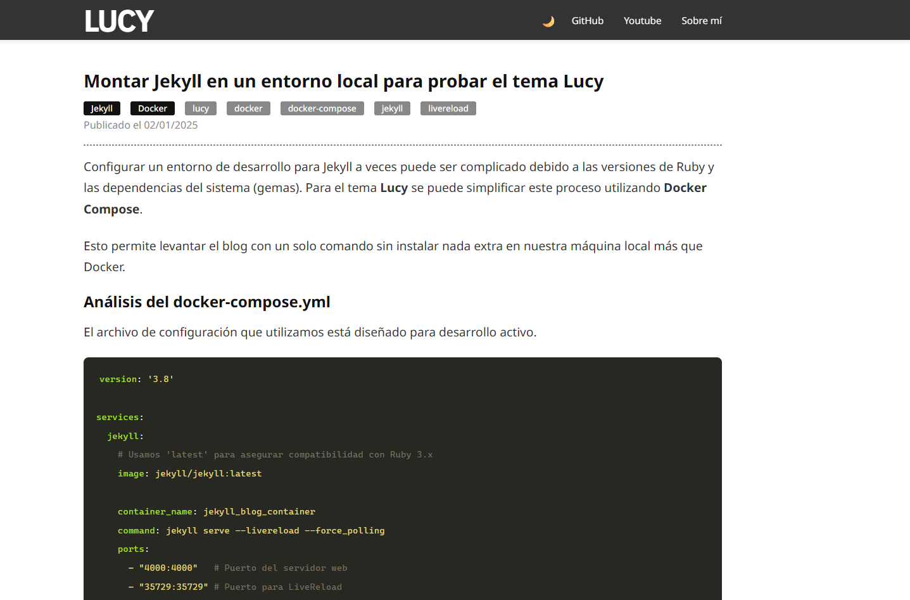

# LUCY Theme


**LUCY** is a minimalist, clean, dark-mode Jekyll theme designed for developers, writers, and photographers.  
It focuses on speed, readability, and ease of use.

> **Note:** This theme is fully compatible with GitHub Pages.

---

## 📸 Screenshots



---

## ✨ Features

- 📱 **Fully Responsive:** Looks great on mobile and desktop.
- ⚡ **Lightweight:** No heavy frameworks, just pure HTML/CSS.
- 🌑 **Dark and Light Mode:** Two themes to choose. You can add more if you want.
- 🎨 **Easy Customization:** Configure everything from `_config.yml`.
- 📝 **Syntax Highlighting:** Native support for code blocks.

---

## 📦 Installation

There are three ways to use LUCY:

---

### Option 1: As a Ruby Gem (Recommended)

Add this line to your Jekyll site's `Gemfile`:

```ruby
gem "lucy-theme"
```

And add this to your `_config.yml`:

```yaml
theme: lucy-theme
```

Then run:

```bash
bundle install
```

---

### Option 2: Fork & Clone & Docker

1. Fork this repository.
2. Clone it:

```bash
git clone https://github.com/angelsimon/lucy.git
```

3. Serve using Docker

```bash
docker run --rm -it -v "${PWD}:/srv/jekyll" -p 4000:4000 jekyll/jekyll jekyll serve
```

---

## ⚙️ Configuration

Edit your `_config.yml` to customize the site.

```yaml
title: "My Awesome Blog"
description: "A blog about tech and retrogames"
url: "https://example.com"

author:
  name: Your name
  github: https://github.com/tu-usuario
  youtube: https://www.youtube.com/@tu-canal
```

---

## 📝 Usage

### Creating a new post

Create a file in the `_posts` directory using the following format:

```
YYYY-MM-DD-title-of-post.md
```

```yaml
---
layout: post
title: "Welcome to LUCY"
date: 2025-10-27 12:00:00 -0300
categories: [update]
tags: [news, jekyll]
---
```

Write your content here…

---

## 🤝 Contributing

Bug reports and pull requests are welcome on GitHub:  
https://github.com/angelsimon/lucy

---
